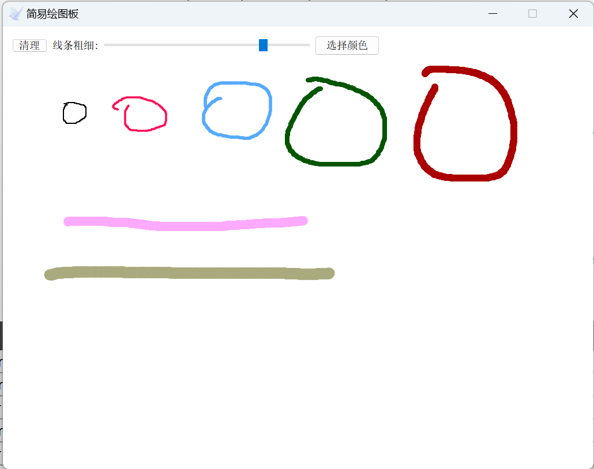

# 简易绘图板

这是一个基于 Qt 框架开发的小工具，旨在提供用户一个简单方便的绘图环境。用户可以在绘图板上自由绘制线条，并且可以选择线条的粗细和颜色，同时也提供清空画布的功能。

## 功能特点

- 自由绘制线条
- 线条粗细选择
- 颜色选择功能
- 清空画布

## 如何使用

1. 使用鼠标左键按下并拖动即可在画布上绘制线条。
2. 可以通过线条粗细选择器选择线条的粗细。
3. 点击颜色选择按钮可以选择线条的颜色。
4. 点击清理按钮可清空画布。

## 技术细节

- 使用 Qt 框架实现界面和交互逻辑。
- 使用 QPainter 进行绘图操作。
- 使用信号与槽机制处理用户交互。

## 依赖

- Qt 框架

## 如何编译和运行

1. 安装 Qt 开发环境。
2. 使用 Qt Creator 或者命令行编译器编译源代码。
3. 运行生成的可执行文件即可启动绘图小工具。

